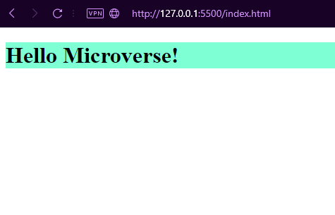

# Hello Microverse Project

> Project created to learn how to setup a project in Github

## Built With

- HTML
- CSS

## Authors

👤 **Author**

- GitHub: [@ryxtor](https://github.com/ryxtor)
- Twitter: [@ryxtor](https://twitter.com/ryxtor)
- LinkedIn: [LucasBonnefon](https://www.linkedin.com/in/lucas-bonnefon-074a01134/)

## 🤝 Contributing

Contributions, issues, and feature requests are welcome!